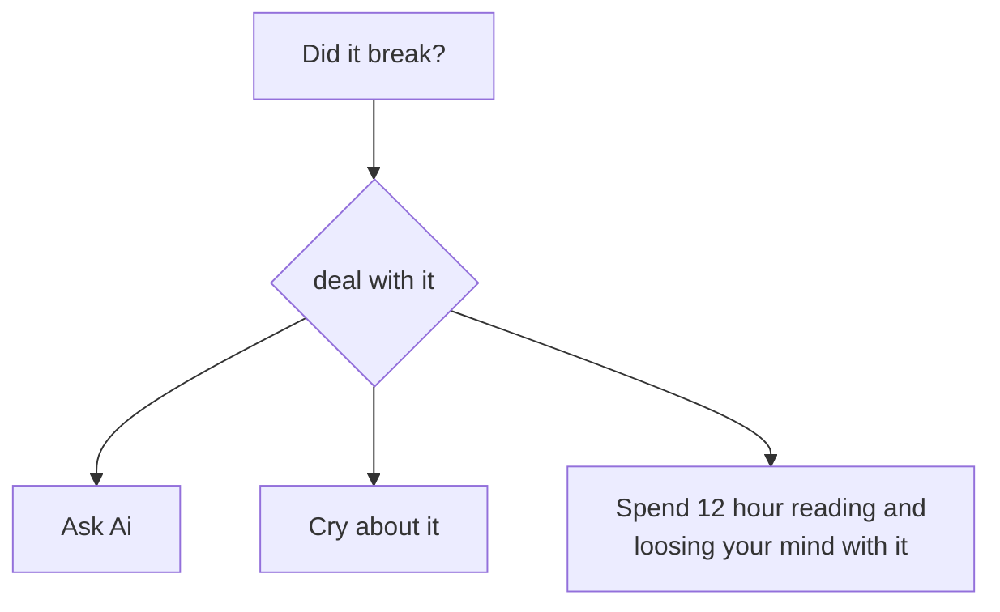

h# Step by step manual 

## 1. First

Turn on the XAMPP Apache and mySQL server and copy the port number of mySQL  
then go to db.js and paste the port number into the  
        `port: 3307` -> `port: your_port_num`

## 2. Second

Go to php_my_admin and copy the name of the database that you what to use. The database must be empty.
paste the name of the database into the  
        `database: mydb` -> `database: name_of_db`

## 3. Third

In the command prompt run:  

```
>node words.js
Profile Table crated
>node server.js
Server running on http://localhost:3000
```

* you have to have node installed

## 4. Fourth

Go to http://localhost:3000 and see if it works


